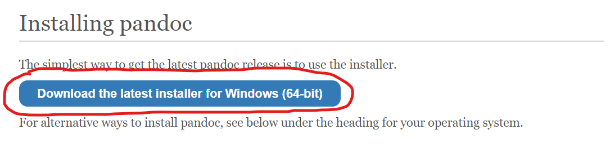
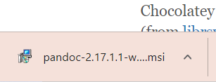
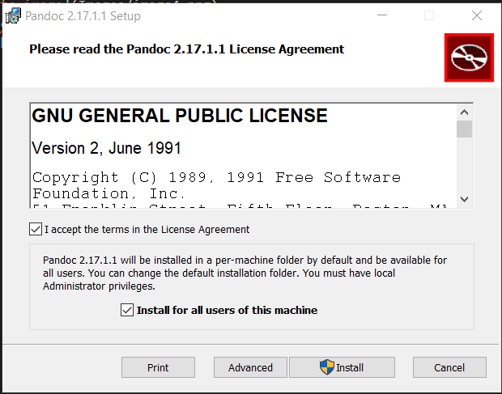
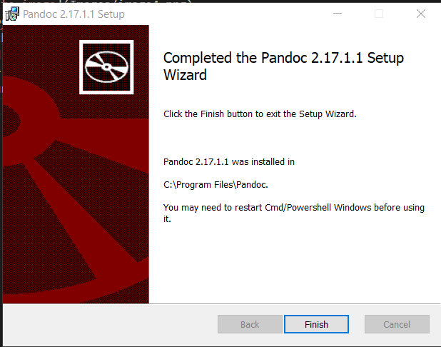
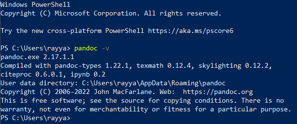

# How to Install Pandoc

Installing Pandoc is extremely easy and straight forward to do. As a bonus, it is free you so you will get a useful process with no charges.

## Prerequisites

- Basic command line knowledge
- Windows 10 OS
- Knowledge if CPU is 32-bit or 64-bit

## Steps

1. Go to the Pandoc website ([www.pandoc.org](https://pandoc.org/)).
2. Click the installing page at the top of the screen (Figure 2).

    <figure>
        
        <figcaption><i>Figure 2: Image of Pandoc home page indicating where installing page is.</i></figcaption>
    </figure>

3. Click the button labeled "Download the latest installer for Windows" (Figure 3).

    <figure>
        
        <figcaption><i>Figure 3: Image of Pandoc installing page indicating where installer is.</i></figcaption>
    </figure>

    >*Note: The image show in the above picture is for a 64-bit CPU. If your CPU is not 64-bit, click the install button corresponding to what your computer is.*

4. Allow Pandoc to install by clicking the installer that was downloaded in the bottom left of the screen (Figure 4).

    <figure>
        
        <figcaption><i>Figure 4: Image of Pandoc installer.</i></figcaption>
    </figure>

    >*Note: A Pandoc setup wizard will now appear on the screen.*

5. After reading the terms of use, check the "I accept the terms in the License Agreement" box and click install (Figure 5).

    <figure>
        
        <figcaption><i>Figure 5: Image of Pandoc setup wizard showing terms of use.</i></figcaption>
    </figure>

    >*Note: If your computer asks if it is fine for the executable to make changes to your computer, allow it to make changes.*

6. Click the "Finish" button to complete the installation and exit out of the Setup Wizard (Figure 6).

    <figure>
        
        <figcaption><i>Figure 6: Image of Pandoc setup wizard showing installation has completed.</i></figcaption>
    </figure>

7. Open up a Terminal.
8. To check if Pandoc has installed, type in the command "pandoc -v" and the version of Pandoc installed will be shown (Figure 7).

    <figure>
        
        <figcaption><i>Figure 7: Image of Windows terminal running command to check Pandoc version.</i></figcaption>
    </figure>

You have now installed Pandoc! You can now convert files to different formats using Pandoc. To learn how to convert from a Word document to Markdown or vice versa, look at the other sections provided.


