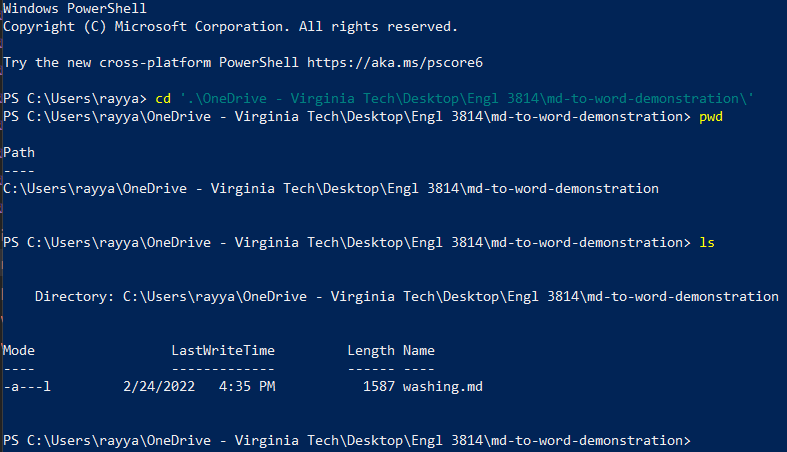
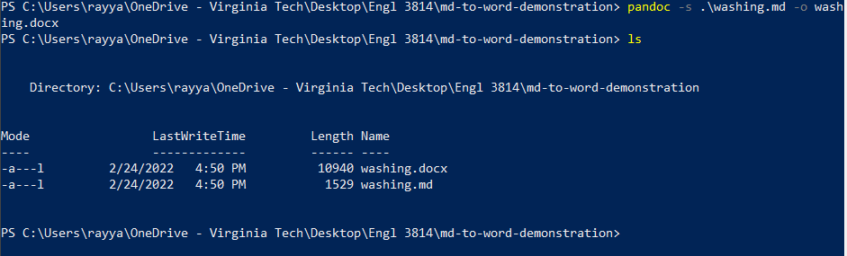

# How to Convert from Markdown to Word

One of the many capabilities of Pandoc is that it allows you to automatically convert Markdown files to Word documents. This will allow you to have a version of your Markdown file in a more commonly used format used by people.

## Prerequisites

- Pandoc installed
- Basic command line knowledge
- Windows 10 OS
- Markdown file to convert

## Steps

1. Open a terminal.
2. Change your directory to the one that contains the file you would like to convert from Markdown to a Word document (Figure 10).

    <figure>
        
        <figcaption><i>Figure 10: Image of terminal showing the changing of directories to one containg Markdown file.</i>
        </figcaption>
    </figure>

    >*Note: You can check that you are in the right directory by using the command "pwd" to check the path to the current directory you are in and "ls" to check what is in the current directory.*

3. Convert the Markdown file to a Word document by typing the command "pandoc -s *[Name of file]*.md -o *[Desired name of file]*.docx" (Figure 11).

   <figure>
        
        <figcaption><i>Figure 11: Image of terminal showing the command used to convert Markdown file to Word document.</i>
        </figcaption>
    </figure>

You have now converted a Markdown file to a Word document using Pandoc!


