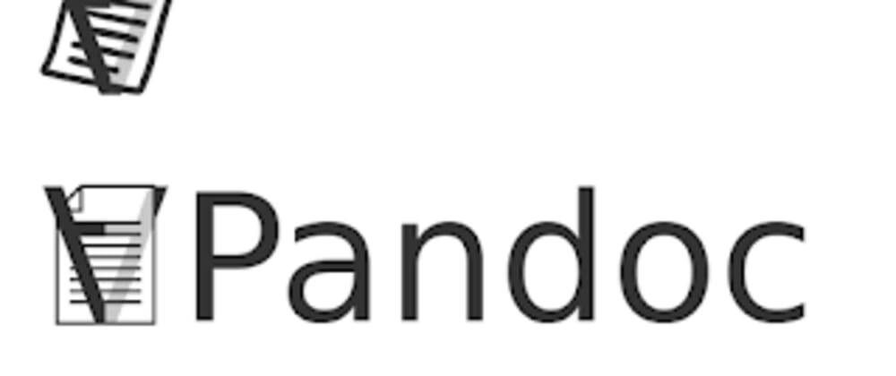

# What is Pandoc?

Pandoc is a free and open-source software that is used to convert a variety a markup formats to others. Pandoc is a tool that is run from the command line so a basic understanding of how to use a terminal and run commands is needed to use it. Pandoc offers users an automatic conversation tool so that you can have multiple different markup formats (word, markdown, html, etc.) of the same document with ease.

<figure>
    
    <figcaption><i>Figure 1: Markdown logo</i></figcaption>
</figure>


