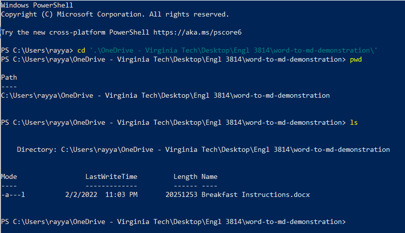
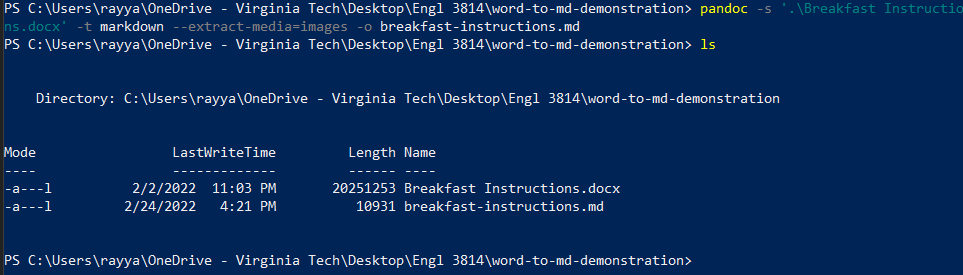

# How to Convert from Word to Markdown

One of the many capabilities of Pandoc is that it allows you to automatically convert word documents to Markdown. This will allow you to have a version of your document in a more structured format which is useful to creating a website like GitHub Pages.

## Prerequisites

- Pandoc installed
- Basic command line knowledge
- Windows 10 OS
- Word document to convert

## Steps

1. Open a terminal.
2. Change your directory to the word document that you would like to convert to Markdown (Figure 8).

    <figure>
        
        <figcaption><i>Figure 8: Image of terminal showing the changing or directories to word document.</i>
        </figcaption>
    </figure>

    >*Note: You can check that you are in the right directory by using the command "pwd" to check the path to the current directory you are in and "ls" to check what is in the current directory.*

3. Delete all cover pages and table of contents in the word document.

    >**Warning:** Not deleting these things from the document may causes issues when converting to markdown.

4. Convert the word document to markdown by typing the command "pandoc -s *[Name of file]*.docx -t markdown --extract-media=images -o *[Desired name of file]*.md" (Figure 9).

    <figure>
        
        <figcaption><i>Figure 9: Image of terminal showing the command used to convert word document to markdown.</i>
        </figcaption>
    </figure>

You have now converted a word document to markdown using Pandoc! Remember, automation is not perfect so go into the markdown file and clean up any extra things add to the markdown during the conversion process.


